# 【Flex 布局】

阅读：

1. [阮一峰 Flex 布局教程：语法篇](http://www.ruanyifeng.com/blog/2015/07/flex-grammar.html?utm_source=tuicool)
2. [一篇文章弄懂 flex 布局](https://www.cnblogs.com/echolun/p/11299460.html)

## 前置

并列书写多个 `<div>` 标签，它们会纵向向下排位，即：

```html
<div class="container">
  <div class="box b-1">1</div>
  <div class="box b-2">2</div>
  <div class="box b-3">3</div>
  <div class="box b-4">4</div>
</div>
```

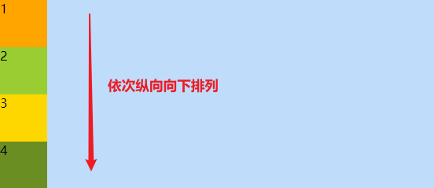

如果想让 div 们以行排列，传统 **盒模型** 做法借助 `position`、`float`、`display` 等属性实现；

## Flexible Box

- **flex 布局**（弹性布局）是一种新的布局方案，通过修改父元素 `display` 属性，使其成为一个 `flex容器`，从而自由操控其内子元素；

- **flex 布局属性主要由 `容器属性` 和 `项目属性` 构成**；

```html
<!-- 父元素(container)：关注容器属性-->
<div class="container" style="background: #bfdcfb;">
  <!-- 子元素(box)：关注项目属性-->
  <div class="box b-1">1</div>
  <div class="box b-2">2</div>
  <div class="box b-3">3</div>
  <div class="box b-4">4</div>
</div>
```

## 容器属性

### flex-direction

- 用于控制项目排列方向与顺序；
- 取值：

| 属性值         | 说明                 | COPY                            |
| -------------- | -------------------- | ------------------------------- |
| row[默认]      | 横向，顺序，左 👉 右 | flex-direction: row;            |
| row-reverse    | 横向，倒序，右 👉 左 | flex-direction: row-reverse;    |
| column         | 纵向，顺序           | flex-direction: column;         |
| column-reverse | 纵向，倒序           | flex-direction: column-reverse; |

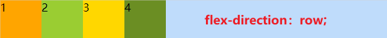
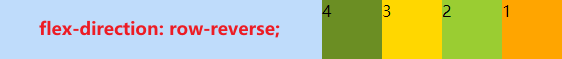
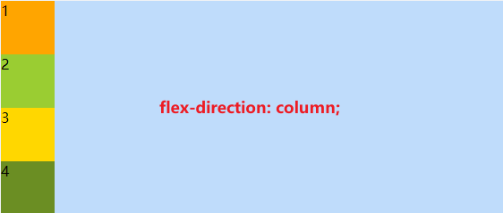
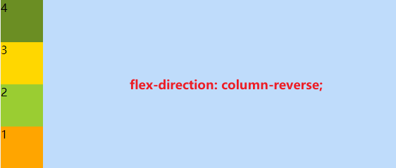

### flex-wrap

- 用于控制项目是否换行；
- 取值：

| 属性值       | 说明                   | COPY                     |
| ------------ | ---------------------- | ------------------------ |
| nowrap[默认] | 不换行(子元素宽度等分) | flex-wrap: nowrap;       |
| wrap         | 换行                   | flex-wrap: wrap;         |
| wrap-reverse | 换行，倒序反向         | flex-wrap: wrap-reverse; |

- 栗子：

```css
.container {
  width: 200px;
  height: 200px;
  display: flex;
  flex-direction: row;
  /* - - - demo修改属性（flex-wrap） - - - */
  flex-wrap: nowrap;
  /* flex-wrap: wrap; */
  /* flex-wrap: wrap-reverse; */
  .box {
    width: 60px;
    height: 30px;
  }
}
```

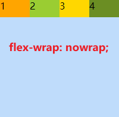

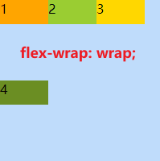

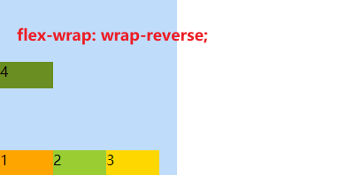

### flex-flow[推荐使用]

- `flex-deriction` 与 `flex-wrap` 属性的简写集合；
- 取值：

| 属性值           | 说明                   |
| ---------------- | ---------------------- |
| row nowrap[默认] | 横向排列，不换行       |
| ...              | 【自己按上面排列组合】 |

### justify-content

- 用于控制项目在横轴的对齐方式；
- 取值：

| 属性值           | 说明                                                  |
| ---------------- | ----------------------------------------------------- |
| flex-start[默认] | 左对齐                                                |
| flex-end         | 右对齐                                                |
| center           | 居中                                                  |
| space-between    | 左右两端对齐                                          |
| space-around     | 项目之间间距为左右两侧项目到容器间距的 2 倍[较少使用] |
| space-evenly     | 两端、间距相同                                        |

- 栗子：

```css
.container {
  width: 550px;
  display: flex;
  flex-direction: row;
  flex-wrap: nowrap;
  /* - - - demo修改属性（justify-content） - - - */
  justify-content: flex-start;
  /* justify-content: flex-end; */
  /* justify-content: center; */
  /* justify-content: space-between; */
  /* justify-content: space-around; */
  /* justify-content: space-evenly; */
  .box {
    width: 60px;
    height: 30px;
  }
}
```

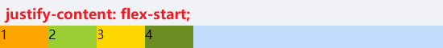
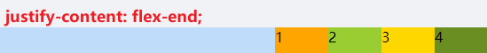
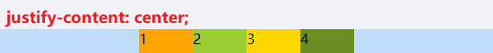

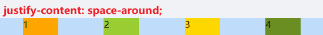
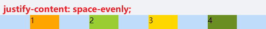

### align-items

- 用于控制项目在纵轴排列方式；
- 取值：

| 属性值        | 说明                      |
| ------------- | ------------------------- |
| stretch[默认] | 若未设置高度，则高度 auto |
| flex-start    | 处于纵轴顶部              |
| flex-end      | 处于纵轴底部              |
| center        | 处于纵轴中心              |
| baseline      | 以第一行文字基线为准      |

- 栗子：

```css
.container {
  width: 400px;
  display: flex;
  flex-direction: row;
  flex-wrap: nowrap;
  justify-content: flex-start;
  /* - - - demo修改属性（align-items） - - - */
  align-items: stretch;
  .box {
    width: 60px;
    height: 100px;
  }
}
```

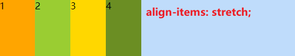

```css
.container {
  width: 400px;
  height: 150px;
  display: flex;
  flex-direction: row;
  flex-wrap: nowrap;
  justify-content: flex-start;
  /* - - - demo修改属性（align-items） - - - */
  align-items: flex-start;
  /* align-items: flex-end; */
  /* align-items: center; */
  .box {
    width: 60px;
    height: 60px;
  }
}
```

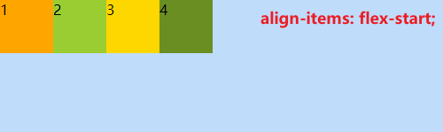
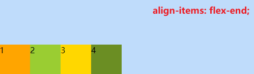
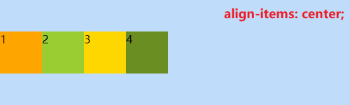

```css
.container {
  width: 400px;
  height: 150px;
  display: flex;
  flex-direction: row;
  flex-wrap: nowrap;
  justify-content: flex-start;
  /* - - - demo修改属性（align-items） - - - */
  align-items: baseline;
  .box {
    width: 60px;
    height: 60px;
  }
  .b-1 {
    padding-top: 20px;
  }
  .b-2 {
    padding-top: 10px;
  }
}
```

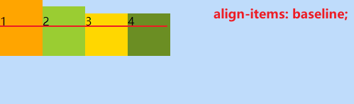

### align-content

- ；
- 取值：

| 属性值        | 说明 |
| ------------- | ---- |
| stretch[默认] |      |
| flex-start    |      |
| flex-end      |      |
| center        |      |
| space-between |      |
| space-around  |      |
| space-evenly  |      |

## 项目属性

### order

- 用于决定项目排列顺序；
- 取值：默认 0（数值越小，项目排列越靠前）；

### flex-grow

- 用于决定项目在有剩余空间的情况下是否放大；
- 取值：默认 0（不放大）；

### flex-shrink

- 用于决定项目在空间不足时是否缩小；
- 取值：默认 1；

### flex-basis

- 用于设置项目宽度；
- 取值：默认 auto；

### flex

- flex-grow，flex-shrink 与 flex-basis 三个属性的简写，用于定义项目放大，缩小与宽度；
- 取值：默认 0 1 auto；

### align-self

- 表示继承父容器的 align-items 属性，若无父元素，则默认 stretch；
- 取值：

| 属性值     | 说明 |
| ---------- | ---- |
| auto[默认] |      |
| flex-start |      |
| flex-end   |      |
| center     |      |
| baseline   |      |
| stretch    |      |
