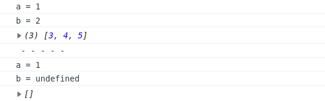

# Learn | 函数

- 函数是最基本的一种代码抽象的方式；

## 函数定义 & 调用

```js
// 1- 直接定义
function xxx（）{ ... }

// 2- 匿名函数赋值于变量
var xxx = funcyion () { ... }
```

- 函数体内部的语句在执行时，一旦执行到 `return` 时，函数就执行完毕，并将结果返回；
- 若无 `return` 语句，函数执行完毕后也会返回结果，结果为 `undefined`；
- JavaScript 允许传入任意个参数而不影响调用，即使传入参数数量多于/少于定义参数均没有问题；
- 为避免收到 `undefined`，可对参数进行检查；

#### arguments

- JavaScript 还有一个免费赠送的关键字 `arguments`，它只在函数内部起作用，且永远指向当前函数的调用者传入的所有参数
- `arguments` 类似 `Array` **但它不是一个 `Array`**；
- 利用 `arguments`，你可以获得调用者传入的所有参数，亦即，即使函数不定义任何参数，还是可以拿到参数的值；
- `arguments` 最常用于判断 **传入参数** 的个数（不是定义的函数个数哟）；

```js
function foo(a) {
  console.log(arguments)
  console.log(arguments.length)
  console.log(typeof arguments)
}
foo('c', 's', 'y')

// arguments 类似 Array，但它不是一个 Array
```


#### rest 参数

- ES6 引入；

```js
function foo(a, b, ...rest) {
  console.log('a = ' + a)
  console.log('b = ' + b)
  console.log(rest)
}
foo(1, 2, 3, 4, 5)
console.log(' - - - - - ')
foo(1)

// 将未指明定义的多余参数赋予变量 rest → 无需 arguments 来获取全部参数
// 若传入参数不满，rest 参数将接收一个空数组，而非 undefined
```



## 变量作用域 & 解构赋值

- 在 JavaScript 中，`var` 声明的变量是有作用域的；
- 若变量声明在函数内部，那么其作用域在于函数体 → 不同函数内部声明相同名的变量将互不影响；
- JavaScript 可嵌套 → 内部函数可访问外部函数定义的变量，反之不可；
- 若内部函数定义了与外部函数重名的变量，则内部函数的变量将“屏蔽”外部函数的变量；

#### 变量提升

- 在 JavaScript 中，其会先扫描整个函数体的语句，将变量的声明 “提升” 到函数顶部 → JavaScript 引擎会自动提升变量的声明，但其赋值并不会跟着提升；

#### 全局作用域

- 不在任何函数内定义的变量就具有全局作用域；
- JavaScript 默认有一个全局对象 `window`，全局作用域的变量实际就被绑定成了 `window` 的一个属性；
- 函数的定义有 2 种，以 **匿名函数定义并赋予变量** 的方式实际上也就是定义了一个全局变量 → 故顶层函数的定义也将被看作是一个 **全局变量**，并绑定于 `window` 对象；
- 任何变量（函数也视为变量），若未在当前函数作用域中找到，就会继续往上查找，最后若在全局作用域中也没有找到，则报 `ReferenceError` 错误；

#### 名字空间

- 全局变量会绑定到 `window` 上，不同的 JavaScript 文件若使用了相同的全局变量，或定义了相同名字的顶层函数，都会造成命名冲突；
- 减少冲突的一个方法：将自己的所有变量和函数全部绑定到一个全局变量中；

```js
// 唯一全局变量
var CSY = {}
// 其他变量
CSY.name = 'samyechan'
// 其他函数
CSY.foo = function () { ... }
```

#### 局部作用域

- `for` 循环等语句块中无法定义含局部作用域的变量 → ES6： `let` & `const`（具块级作用域）

### 解构赋值

- ES6 → 支持同时对一组变量/多个变量进行赋值；
- 对数组元素进行解构赋值时，多个变量要用 `[...]` 括起来；
- 若需从一个对象中取出若干属性，亦可使用解构赋值，以便快速获取对象的指定属性；

```js
var { name, age, passport } = person // person 是一个已定义对象

// 若对象中需要新赋值的变量名与原先对象中的不一致(例：将原 id 赋予新 passport)
var { name, age, passport: id } = person
```

- 使用解构赋值对对象属性进行赋值时，如果对应的属性不存在，变量将被赋值为 `undefined`；
- 解构赋值可大大简化带代码量；

## 方法

- 在一个对象中绑定函数，称为这个对象的方法；
- 在一个方法内部，`this` 是一个特殊变量，它始终指向当前对象；

<div style="text-align: center; margin-top: 35px;">2019-06-26 · samyec</div>
