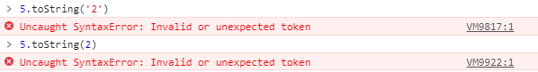
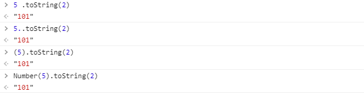

# 第 02 周

## 2021.03.29

### 【表述】css 选择器有哪些？优先级？哪些属性可以继承？

👉 [参考答案](https://mp.weixin.qq.com/s/hCaRwKswMVdK8ZrYfqcTcA)

👉 小声的小结：

#### 回答答 ⭐

1. `CSS选择器` 是 CSS 规则的第一部分 → 元素+其他部分组合起来告诉浏览器哪个 HTML 元素应当是被选作应用规则中的 CSS 属性值的方式；

- 【常用】CSS 属性选择器：
  - `id选择器`（#box）
  - `类选择器`（.content）
  - `标签选择器`（div）
  - `后代选择器`（#box div）
  - `子选择器`（.content>.title）
  - `相邻同胞选择器`（.content1+.content2）
  - `群组选择器`（div,p）
- 【不常用】伪类选择器：
  - `:link` → 选择未被访问的链接；
  - `:visited` → 选择已被访问的链接；
  - `:active` → 选择当前选中的链接；
  - `:hover` → 当鼠标在元素上悬浮；
  - `:focus` → 当元素被聚焦；
  - `:first-child` → 父元素的首个子节点；
- 【不常用】伪元素选择器：
  - `:first-letter` → 指定元素首字母；
  - `:first-line` → 指定元素首行；
  - `:before` → 在被选元素内容前插入内容；
  - `:after` → 在被选元素内容后插入内容； -【不常用】属性选择器：
  - `[attribute]` → 选择带有 attribute 属性的元素；
  - `[attribute=value]` → 选择所有使用 attribute=value 的元素；
  - `[attribute~=value]` → 选择 attribute 属性包含 value 的元素；
  - `[attribute|=value]` → 选择 attribute 属性以 value 开头的元素；

【CSS3 新增选择器：层次选择器、伪类选择器、属性选择器】

2. 优先级

> 内联 > ID 选择器 > 类选择器 > 标签选择器

- 到具体的计算层⾯，优先级是由 A 、B、C、D 的值来决定的：

【这一块有点堵了...】

3. 继承属性

- 在 CSS 中，继承是指给父元素设置一些属性，后代元素回自动拥有这些属性；
  - 字体系列属性；
  - 文本系列属性；
  - 元素可见性；
  - 表格布局属性；
  - 列表属性；
  - 引用；
  - 光标属性；
- 特殊地：
  - a 标签的字体颜色不被继承；
  - h1-h6 标签字体的大小不被继承；
- 无继承属性：
  - display；
  - 文本属性：vertical-align、text-decoration；
  - 盒子模型属性：宽度、高度、内外边距、边框等；
  - 背景属性：背景图片、颜色、位置等；
  - 定位属性：浮动、清除浮动、定位 position 等；
  - 生成内容属性：content、counter-reset、counter-increment；
  - 轮廓样式属性：outline-style、outline-width、outline-color、outline；
  - 页面样式属性：size、page-break-before、page-break-after；

### 【概念】foo

1. 计算机中的 foo 是什么？

我觉得是外国人的张三、李四、王麻子，没有特殊的意义，就是个 demo 词儿吧...

### 【更多】

- 今天发现了一个宝藏 up 主 👉 objtube 的卢克儿，风格很老喜欢了，感觉跟着学习就很 nice~

  1. [互联网是如何运作的？](https://www.bilibili.com/video/BV1Rz4y197Jd)
  2. [浏览器是如何运作的？](https://www.bilibili.com/video/BV1x54y1B7RE)

## 2021.03.30

### 【表述】说说 em/px/rem/vh/vw 区别?

👉 [参考答案](https://mp.weixin.qq.com/s/LYCV3MtA2U-1HEX3G5yhWg)

👉 小声的小结：

#### 回答答 ⭐

- 上述所有都是 CSS 提供的一些计量单位；
- 【px】绝对单位，页面按精确像素展示；
- 【em & rem】相对单位，前者基于父元素字体大小定义，后者基于根元素字体大小定义；
- 【vh、vw】相对单位，主要用于页面视口大小布局；

#### 详述

- 一般开发中，我们用到比较多是 `px`、`%`、`em`，它们适用于大部分的项目开发，而且拥有比较良好的兼容性；
- 而从 CSS3 开始，浏览器支持的单位又新增了 `rem`、`vh`、`vw`、`vm` 等，更好支持了兼容多类终端的响应式页面开发；

1. CSS 单位中，可分为两类：相对单位、绝对单位，具体如下：

| 类别         | 从属单位                               |
| ------------ | -------------------------------------- |
| 相对长度单位 | em、ex、ch、rem、vw、vh、vmin、vmax、% |
| 绝对长度单位 | cm、mm、in、px、pt、pc                 |

2. px

- 绝对单位 → 其大小与元素其他属性无关；
- 像素是呈现在显示器上的一个个小点，每个像素点都大小等同；
- 在移动端中存在设备像素比，so `px` 实际大小是不确定的；

3. em

- 相对单位 → 相对于当前对象文本的**字体尺寸**，若未设置，则默认相对于浏览器默认尺寸（`1em = 16px`）；
- 为简化 `font-size` 换算，可在 body 设置如下：

```css
body {
  font-size: 62.5%;
  /* 使em值变为 16px*62.5% = 10px */
}
```

**注意：** 浏览器 font-size 最小值为 12px；

4. rem

- 相对单位 → 相对的只是根元素 html 的 font-size；
- 同理简化 font-size 换算：

```css
html {
  font-size: 62.5%;
  /* 使em值变为 16px*62.5% = 10px */
}
```

**em vs rem**：相对于的元素不一致，前置使用级联方式计算，后者仅针对根元素；

5. vh、vw

- 相对单位 → vw 将窗口分成 100 份，100vw 即满宽，同理 vh；
- 窗口的几种情况：

  1. PC 端，指浏览器的可视区域；
  2. 移动端，指布局视口；

**vw、vh vs %**：前者相对于窗口，后者宽泛而言相对于父元素；

### 【概念】STAR/k8s/Host

1. STAR 法则

- Situation：事情是在什么情况下发生，基于一个怎样的背景；
- Task：你是如何明确你的任务的；
- Action：针对这样的情况分析，你采用了什么行动方式，具体做了哪些工作内容；
- Result：结果怎样，带来了什么价值，在整个过程中你学到了什么，有什么新的体会。

2. k8s（Kubernetes）

- 一个开源的用于管理云平台中多个主机的容器化的应用；
- 目标让部署容器化的应用简单且高效；
- 提供了应用部署、规划、更新、维护的一种机制；

3. Host

- Host 请求头指明了请求将要发送到的服务器主机名和端口号；
- 若未包含端口号，会自动使用被请求服务的默认端口（比如 HTTPS URL 使用 443 端口，HTTP URL 使用 80 端口）；
- 所有 HTTP/1.1 请求报文中必须包含一个 Host 头字段；
- 对于缺少 Host 头或者含有超过一个 Host 头的 HTTP/1.1 请求，可能会收到 400（Bad Request）状态码。

### 【更多】

- 好歌 👉 Before The Last Leaf Falls（旋律和《杀了我，治愈我》插曲好像，一波回忆杀+\_+）
- 好文 👉 [if 我是前端团队 Leader，怎么制定前端协作规范?](https://juejin.cn/post/6844903897610321934#heading-37)
- 工具 👉 [Diffchecker](https://www.diffchecker.com/diff)

## 2021.03.31

### 【表述】说说设备像素、css 像素、设备独立像素、dpr、ppi 之间的区别？

👉 [参考答案](https://mp.weixin.qq.com/s/kQ32ujsmud5E_B4fMXRZNg)

👉 小声的小结：

#### 回答答 ⭐

#### 详述

- 在 CSS 中通常使用 `px` 作为单位，在 PC 浏览器中 CSS 的 `1px` 对应着电脑屏幕的 1 个物理像素 → 错觉：`CSS像素 === 设备物理像素`（❌）；
- [ 不同设备或不同环境中，CSS 中的 qpx 所代表的物理像素是不同的 ]

1. **CSS 像素**

### 【概念】SLB

1. SLB

- 服务器负载均衡（Server Load Balancer）；
- 负载均衡（Load Balancer），本质上用于将用户流量进行均衡减压；
- 负载均衡技术方案：
  1. 基于 DNS - 实现地域上的流量均衡；
  2. 基于硬件 - 用于大型服务器集群中的负载需求；
  3. 基于软件 - 基于机器层面的流量均衡；

👉 [负载均衡](https://www.jianshu.com/p/69340b4f5652)

### 【更多】

1. 关于 `toString()` 转二进制；

- ❌ 报错：



> toString() 方法可把一个 Number 对象转换为一个字符串，并返回结果；

- ✔ 正确：



- 原因：
  - `.` 被解析成小数点，变成了 ` 5.0tostring`；
  - 加 ` ` 或 `.` 避免正确 `.` 被解析错误；
  - `()` 或 `Number()` 直接显性转换了；

2. [组件的可重用性](https://segmentfault.com/a/1190000039699016?_ea=116162140)

## 2021.04.01

### 【表述】css 中，有哪些方式可以隐藏页面元素？区别?

👉 [参考答案](https://mp.weixin.qq.com/s/1tnP66WsEZHEDNcNV2srRA)

👉 小声的小结：

#### 回答答 ⭐

#### 详述

### 【概念】devOps/hooks

1. devOps

2. hooks

### 【更多】

1. [京东 vue3 组件库震撼升级，如约而至！](https://juejin.cn/post/6945601440064733198?utm_source=gold_browser_extension)
2. [文本溢出与 Tooltip，如何更好的处理二者](https://github.com/iplaces/blog/issues/3)

- span 中的 offsetWidth...

3. Vue3 相关：[vue3 中文文档](https://v3.cn.vuejs.org/)、[router4](https://next.router.vuejs.org/zh/)

> Some people feel the rain, others just get wet. 有些人能感受雨，而其他人则只能被淋湿。—— 鲍勃·迪伦

## 2021.04.02

### 【表述】谈谈你对 BFC 的理解？

👉 [参考答案](https://mp.weixin.qq.com/s/4WC-1COpRL0scgPqD3I-Sg)

👉 小声的小结：

#### 回答答 ⭐

#### 详述

1. 是什么

- BFC（Block Formatting Context），块级格式化上下文；
- 它是页面中的一块渲染区域，并且有一套属于自己的渲染规则：

  - 内部的盒子会在垂直方向上一个接一个的放置；
  - 对于同一个 BFC 的俩个相邻的盒子的 margin 会发生重叠，与方向无关；
  - 每个元素的左外边距与包含块的左边界相接触（从左到右），即使浮动元素也是如此；
  - BFC 的区域不会与 float 的元素区域重叠；
  - 计算 BFC 的高度时，浮动子元素也参与计算；
  - BFC 就是页面上的一个隔离的独立容器，容器里面的子元素不会影响到外面的元素，反之亦然；

- BFC 目的是形成一个相对于外界完全独立的空间，让内部的子元素不会影响到外部的元素；

2. 触发条件

触发 BFC 的条件包含不限于：

- 根元素，即 HTML 元素；
- 浮动元素：float 值为 left、right；
- overflow 值不为 visible，为 auto、scroll、hidden；
- display 的值为 inline-block、inltable-cell、table-caption、table、inline-table、flex、inline-flex、grid、inline-grid；
- position 的值为 absolute 或 fixed；

3. 应用场景

- 防止 margin 重叠（塌陷）；
- 清除内部浮动；
- 自适应多栏布局；

### 【概念】TDD/BDD/DDD

1. TDD

### 【更多】
