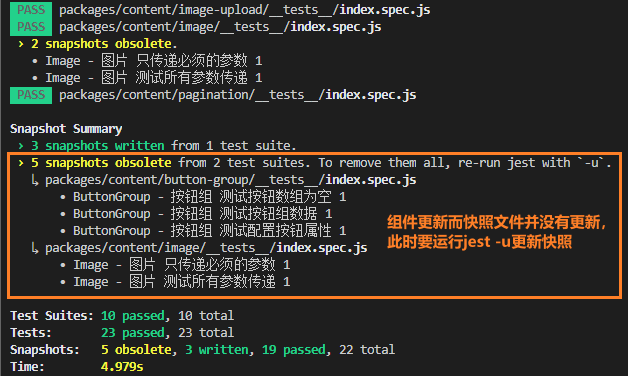

# 【Vue Test Utils】

👉 [文档指路](https://vue-test-utils.vuejs.org/zh/)

- Vue Test Utils 是 Vue.js 官方的单元测试实用工具库；
- 提供了一系列非常方便的工具，使我们更轻松地为 vue 构建的应用来编写单元测试；
- 主流的 JavaScript 测试运行器有很多，但 vue-test-utils 都能支持；
- 它是测试运行器无关的；

## 用 Jest 测试单文件组件

### 放置测试文件

- 默认情况下，Jest 将会递归的找到整个工程里所有 `.spec.js` 或 `.test.js` 扩展名的文件；
- Jest 推荐你在被测试代码的所在目录下创建一个 `__tests__` 目录；

```
[ 为什么以spec.js命名？]

- spec是sepcification的缩写；
- 就测试而言，Specification指的是给定特性或者必须满足的应用的技术细节；
- 最好的理解这个问题的方式是：让某一部分代码成功通过必须满足的规范；
```

### 测试覆盖率

### 测试规范示例

### 快照测试

- snapshot 测试又称快照测试，可以直观地反映出组件 UI 是否发生了未预见到的变化；
- snapshot 如字面上所示，直观描述出组件的样子。通过对比前后的快照，可以很快找出 UI 的变化之处；
- 每当你想要确保你的 UI 不会有意外的改变，快照测试是非常有用的工具；
- 第一次运行快照测试时会生成一个快照文件，之后每次执行测试的时候，会生成一个快照，然后对比最初生成的快照文件，如果没有发生改变，则通过测试，否则测试不通过，同时会输出结果，对比不匹配的地方；
- jest 中的快照文件以为 snap 拓展名结尾；
- 一个快照文件中可以包含多个快照，快照的格式其实是 HTML 字符串，对于 UI 组件，其 HTML 会反映出其内部的 state；
- 每次测试只需要对比字符串是否符合初始快照即可；
- snapshot 测试不通过的原因有两个：
  1. 组件发生了未曾预见的变化，此时应检查代码；
  2. 组件更新而快照文件并没有更新，此时要运行 jest -u 更新快照；



### 断言库

**断言（assertion）是什么？**

- 在程序设计中，断言 是一种一阶逻辑，目的是表示与验证开发者预期的结果；
- 当程序运行到断言的位置时，对于的断言应该为真；若断言为假时，程序会终止并给错误信息；

- `expect` --> 如今是 Jest 的一部分；
- `Chai`、`Sinon`

#### Sinon

## 【Vue Test Utils】

- Vue Test Utils 通过将它们隔离挂载，然后模拟必要的输入 (prop、注入和用户事件) 和对输出 (渲染结果、触发的自定义事件) 的断言来测试 Vue 组件；
- 被挂载的组件会返回到一个包裹器内，而包裹器会暴露很多封装、遍历和查询其内部的 Vue 组件实例的便捷的方法；

## API

### shallowMount 和 mount

## shallowMount 仅仅挂载当前组件实例；而 mount 挂载当前组件实例以外，还会挂载子组件。

```
测试用例一些API介绍
shallowMount 将会创建一个包含被挂载和渲染的 Vue 组件的 Wrapper，只存根当前组件，不包含子组件。
describe(name, fn) 这边是定义一个测试套件，test ToDoList 是测试套件的名字，fn 是具体的可执行的函数
it(name, fn) 是一个测试用例，输入框初始值为空字符串 是测试用例的名字，fn 是具体的可执行函数；一个测试套件里可以保护多个测试用例。
expect 是 Jest 内置的断言风格，业界还存在别的断言风格比如 Should、Assert 等。
toBe 是 Jest 提供的断言方法， 更多的可以到Jest Expect 查看具体用法。
setValue 可以设置一个文本控件的值并更新 v-model 绑定的数据。
.to-do-text 是一个 CSS 选择器；Vue-Test-Utils 提供了 find 方法来通过查找选择器，来返回一个 Wrapper；选择器可以是 CSS 选择器、可以是 Vue 组件也可以是一个对象，这个对象包含了组件的 name 或 ref 属性，比如可以这样用：wrapper.find({ name: 'my-button' })
wrapper.vm 是一个 Vue 实例，只有 Vue 组件的包裹器才有 vm 这个属性；通过 wrapper.vm 可以访问所有 Vue 实例的属性和方法。比如：wrapper.vm.nextTick()。
trigger 方法可以用来触发一个 DOM 事件，这里触发的事件都是同步的，所以不必将断言放到 $nextTick() 里去执行；同时支持传入一个对象，当捕获到事件的时候，可以获取到传入对象的属性。可以这样写：wrapper.trigger('click', {name: "bubuzou.com"})
```

阅读：

👉 [Unit Testing Guidelines](http://fluxens.com/unittesting.html)
