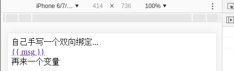
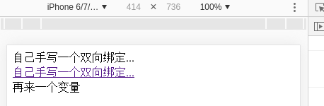

# Learn | ES6 高阶

## defineProperty

- [MDN | Object.defineProperty](https://developer.mozilla.org/zh-CN/docs/Web/JavaScript/Reference/Global_Objects/Object/defineProperty)

首先，我们来定义一个普通的对象：


典型的 `属性+__proto__` 组合，如果要去劫持这个数据，好像无从下手啊...

酱紫的话，我们何不换一种方式去定义对象呢？

登登登登！ `definePeoperty` 出场！

```js
Object.definePeoperty(obj, prop, descriptor)
/**
 * obj - 需定义属性的对象
 *（也可以直接接受一个{}噢 - 不过这样的话，就会又新建一个新对象 - 还是建连接好～）
 * prop - 需定义/修改的属性名称
 * descriptor - 一个对象（“prop的描述符”）
 * 
 * 返回 - 对象
 */
```
一个使用小栗子：

```js
let obj = {}
/**
 * 直接使用 defineProperty() 对 obj 进行重构
 */
Object.defineProperty(obj, 'name', {
  get () {
    console.log('get - - - name');
    return 'samyechan';
  },
  set (newVal) {
    console.log('set - - - ' + newVal);
  }
})
Object.defineProperty(obj, 'age', {
  get () {
    console.log('get - - - age');
    return 22
  },
  set (newVal) {
    console.log('set - - - ' + newVal);
  }
})
console.log('- - - - - obj - - - - - - -');
console.log(obj);
obj.name;
obj.name = 'sc';
console.log('- - - - - - get/set - - - - - -');
console.log(obj);
console.log('- - - - - - for in - - - - - -');
for (let i in obj) {
  console.log(i);
}
```
输出：


- `obj.name` 时，会执行内部 `get` 函数 - 这就拦截数据了呀；
- `obj.name = 'sc';` 时，会执行内部 `set` 函数 - 这也拦截数据了呀；
- 不可对对象进行遍历 - `undefined`；

### 属性 - configurable

- 属性是否可操作（默认false: 不可以对进行修改/删除）；

```js
let obj = {}
Object.defineProperty(obj, 'name', {
  configurable: true, // name可改
  get () {
    return 'samyechan';
  },
  set (newVal) {}
})
Object.defineProperty(obj, 'age', {
  get () {
    return 22
  },
  set (newVal) {}
})
console.log('- - - - - obj - - - - - - -');
console.log(obj);
// + + + 删除操作 + + +
delete obj.name;
delete obj.age;
console.log(obj);
```
输出：


- 设置了 `configurable: true` 的 `name` 被删除，`age` 未被删除；

### 属性 - enumerable

- 属性是否可被循环（默认false）；
- 影响一些函数对对象的操作；

```js
let obj = {}
Object.defineProperty(obj, 'name', {
  enumerable: true, // name可改
  get () {
    return 'samyechan';
  },
  set (newVal) {}
})
Object.defineProperty(obj, 'age', {
  get () {
    return 22
  },
  set (newVal) {}
})
console.log(' - - 设了name，没设age - -');
// + + + + +
for (let i in obj) {
  console.log(i);
}
```

- 设置 `true` 的属性可被打印出来，没设置的属性不可打印；

- 受影响方法（--> 需要可枚举属性才可以哟）：

```js
// 01
for (let i in obj) {}
// 02
Object.keys();
// 03
JSON.stringfy();
// 04
Object.assign
```
[ 可枚举 --> 可以被一枚一枚地列举...hhhhhhhh ]

## Proxy代理

vue2.0 --> defineProperty + 订阅
vue3.0 --> Proxy + TS

## 数据劫持

拦截数据后，进行某些操作

交换数据（传输数据） - xml、json；
js数据 - 对象数组

- 应用：双向绑定

## mvvm

数据驱动、数据优先

vue、angular

```js
// view model
let vm = new Vue({
  el: '#app',
  data: {
    message: '测试数据'
  }
})

```

## ES6 模块化

## AMD / CMD 模块化

## 小栗子

原生js + 面向对象思想的实现

### 插值表达式

### 双向绑定

- [MDN | RegExp.$1-$9](https://developer.mozilla.org/zh-CN/docs/Web/JavaScript/Reference/Global_Objects/RegExp/n)

**[想要的效果]** 像 Vue 一样地去使用：

```vue
<!-- 引入自己的原生手写Cvue框架代码 -->
<script src="./Cvue.js" type="text/javascript"></script>
...
<!-- html 中使用方式与 Vue 相同 -->
<div id="app">
  {{ msg }}
  <div>
    <span>
      <a href="">{{ msg }}</a>
    </span>
  </div>
  {{ anotherMsg }}
</div>
...
<script>
/**
 * 创建一个实例
 */
let vm = new Cvue({
  el: '#app',
  data: {
    anotherMsg: '再来一个变量',
    msg: '自己手写一个双向绑定...'
  }
})
</script>
```
- `new` 方式创建实例，并进行相关配置；
- `{{ 变量名 }}` 形式在 html 中显示，并要绑定实例中的配置变量显示；

#### 数据显示

```js
class Cvue {
  constructor (options) {
    this.options = options;
    this.compile();
  }
  // 找到 {{}}
  compile () {
    // 找到挂载点dom
    let els = document.querySelector(this.options.el);
    // 存储其下的子节点（每次遍历一层返回一个数组）
    let childNodes = els.childNodes;
    childNodes.forEach(node => {
      if (node.nodeType == 1) {
        // 元素
        console.log('- - - 元素 - - -');
        console.log(node);
      } else if (node.nodeType == 3) {
        // 文本
        console.log('- - - 文本 - - -');
        console.log(node);
        // !【正则】匹配{{}}
        let reg = /\{\{\s*(\S+)\s*\}\}/g;
        /**
         * textContent - 拿到【文本】节点上的内容 --> “{{变量名}}”
         */
        let textContent = node.textContent;
        console.log(textContent);
        /**
         * reg.test(...) - 文本节点内容是否含有 {{}} --> 返回 boolean
         */
        let test = reg.test(textContent);
        if (test) {
          /**
           * RegExp.$1 - 符合 {{}} 格式的文本内含部分 --> MDN:仅允许9位（$1-$9）
           */
          let $1 = RegExp.$1;
          console.log($1);
          // 文本节点重新赋值
          // [方法一]
          // node.textContent = this.options.data[$1];
          // [方法二]
          node.textContent = textContent.replace(reg, this.options.data[$1]);
        }
      }
    });
  }
}
```
效果：



以上仅是单层节点的实现，如图，深层的文本节点中的 `msg` 数据未能进行绑定，多层节点变量的双向绑定需要进行 **递归** 了：

```js
compile () {
  let els = document.querySelector(this.options.el);
  let childNodes = els.childNodes;
  // 找{{}}
  this.compileNodes(childNodes);
}
/**
 * 在所有节点中找 {{}}
 */
compileNodes (childNodes) {
  childNodes.forEach(node => {
    if (node.nodeType == 1) {
      /**
       * 如果元素节点下还有子节点，再执行一次本函数（递归再找）
       */
      if (node.childNodes.length > 0) {
        this.compileNodes(node.childNodes);
      }
    } else if (node.nodeType == 3) {
      let reg = /\{\{\s*(\S+)\s*\}\}/g;
      let textContent = node.textContent
      let test = reg.test(textContent);
      if (test) {
        let $1 = RegExp.$1;
        node.textContent = textContent.replace(reg, this.options.data[$1]);
      }
    }
  });
}
```
效果：



但其实这个双向绑定还是有问题的，比如：多层数据渲染会有问题的...

#### 数据显示响应修改

1. 定义一个 `observer()` 来对数据进行监听，并使用 `defineProperty` 对数据进行劫持：

```js
// 对数据进行监听
observer (data) {
  // Object.keys(data) - 获取到数据对象里面每一个定义变量的 key 值；
  Object.keys(data).forEach(key => {
    this.defineReact(data, key, data[key]);
  })
}
// 劫持数据
defineReact (data, key, value) {
  Object.defineProperty(data, key, {
    configurable: true,
    enumerable: true,
    get () {
      return value;
    },
    set (newVal) {
      // TODO - 这里需要对数据进行一个新的显示改变
      value = newVal;
    }
  })
}
```

2. 自定义事件实现

```js
// Cvue 继承 EventTarget
class Cvue extends EventTarget {
  constructor (options) {
    super();
  ......
```
**发布订阅**

### 指令