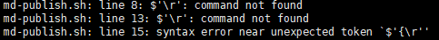
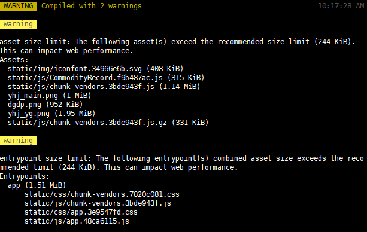
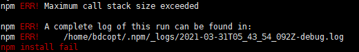
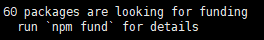
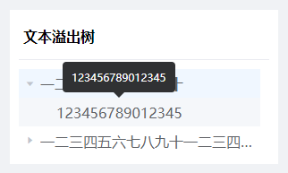

# Question

## 前置

这里大概是一周问题的记录处，一周规整一次到 👉[【问题记录】](../../question/) 模块中噢~ 😜

## 2021.03.29 - 2021.04.04

## 在 Linux 中跑脚本的时候出现 `$'\r':command not found`



#### 【场景】

脚本部署前端代码时出现；

#### 【原因】

文件编码问题，导致有几行行末出现不可识别的\r（windows 换行为\r\n，linux 不识别\r）；

#### 【解决】

去除文件中的\r；

```bash
sed -i 's/\r//g' xx-publish.sh
```

## npm ERR! cb() never called!


#### 【场景】

#### 【原因】

#### 【解决】

## asset size limit / entrypoint size limit



#### 【场景】

#### 【原因】

#### 【解决】

## Maximum call stack size exceeded



#### 【场景】

#### 【原因】

#### 【解决】

## run `npm fund` for details



#### 【场景】

#### 【原因】

#### 【解决】

👉

## 文本溢出与 Tooltip



#### 【场景】

大概就是之前用了最简单粗暴的方式处理了树中文本溢出的情况 → 根据字符数量来控制 tooltip 的有无，啊，就，很明显，遇到非中文字符就完全不 ok 了...

#### 【原因】

暴力估算法，直接通过估算字符数量的多少进行 tooltip 回显，没有考虑更细致的情况；

#### 【解决】

- 每一个 HTML 元素都具有 5 类属性：
  1. clientHeight(clientWidth) → 仅含 padding
  2. offsetHeight(offsetWidth) → padding + border + 滚动条
  3. scrollHeight(scrollWidth) →
  4. offsetTop(offsetLeft) → 当前元素顶部（左侧边框）距离最近的定位父元素顶部（左侧边框）的距离；
  5. scrollTop(scrollLeft) →

👉 [文本溢出与 Tooltip，如何更好的处理二者](https://github.com/iplaces/blog/issues/3)

### el-tree 中的文本溢出与 el-tootip 之间的处理
