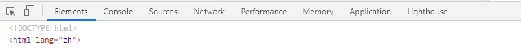

# 【你不知道的 Chrome 调试技巧】

👉 [指路](https://juejin.cn/book/6844733783166418958/section/6844733783187390477)

## 打开 Chrome DevTools

- 在 `Chrome` 菜单中选择 `更多工具 > 开发者工具`；
- 页面右键点击，选择 `检查`；
- windows 系统直接 `F12` 吧~~

## 面板

1. 元素面板 `Elements`
2. 控制台面板 `Console`
3. 源代码面板 `Sources`
4. 网络面板 `Network`
5. 性能面板 `Preformance`
6. 内存面板 `Memory`
7. 应用面板 `Application`
8. 安全面板 `Lighthouse`

### 元素面板 `Elements`

- 检查和调整页面；
- 编辑样式；
- 编辑 DOM；

### 控制台面板 `Console`

开发时，控制台面板：

- 可用作记录诊断信息；
- 可用作为 shell 在页面上与 JavaScript 交互；

### 源代码面板 `Sources`

- 在源代码面板中设置断点来调试 JavaScript；
- 通过 Workspaces（工作区）连接本地文件来使用开发者工具的实时编辑器；

### 网络面板 `Network`

使用网络面板了解请求和下载的资源文件并优化网页加载性能。

- 网络面板基础
- 了解资源时间轴
- 网络带宽限制

### 性能面板 `Preformance`

使用时间轴面板可以通过记录和查看网站生命周期内发生的各种事件来提高页面的运行时性能。

### 内存面板 `Memory`

如果需要比时间轴面板提供的更多信息，可以使用“配置”面板，例如跟踪内存泄漏。

- JavaScript CPU 分析器
- 内存堆区分析器

### 应用面板 `Application`

使用资源面板检查加载的所有资源，包括 IndexedDB 与 Web SQL 数据库，本地和会话存储，cookie ，应用程序缓存，图像，字体和样式表。

管理数据

### 安全面板 `Lighthouse`

使用安全面板调试混合内容问题，证书问题等等。

安全

## 通用篇

- `copy()`；
- hover 需要存储的变量，右键 `Store as global` (存储为一个全局变量)；
- ？保存堆栈信息( Stack trace )；
- 直接 copy HTML；
- `ctrl + shift + D` 👉 切换 `DevTools` 窗口展示布局；
- `ctrl + [` / `ctrl + ]` 👉 切换 `DevTools` 面板；
- `ctrl + shift + P` 👉 查找 `Devtools` 更多的功能；
- 【截屏新姿势】选中节点，`ctrl + shift + P`，输入 screen，点击你需要的 `Screenshot` 标签项；
- 【样式面板布局切换】`ctrl + shift + P`，输入 layout，点击你需要的 `Appearance` 标签项；
- 【Devtools 主题切换】`ctrl + shift + P`，输入 theme，点击你需要的 `Appearance` 标签项；
- 【在 Source 中保存代码块】`Source > Snippets > New Snippets`，运行的两种方式：
  1. 代码块文件中，`Ctrl + Enter`；
  2. 快捷方式：`ctrl + shift + P`，只输入 `!`，输入或选择需要的代码块；

## Console 篇

## 元素面板篇

## Drawer 篇

## Workspace 篇
