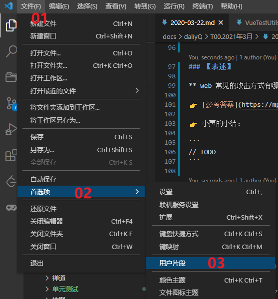
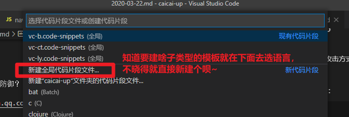
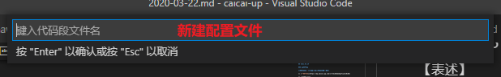
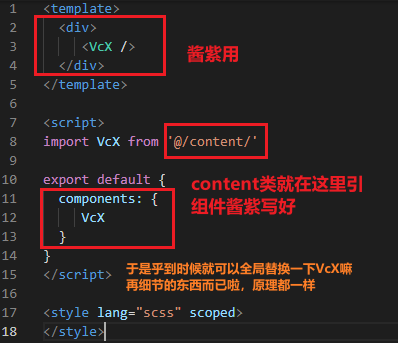
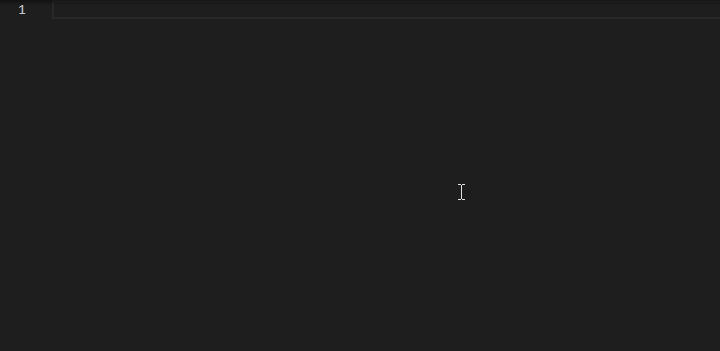
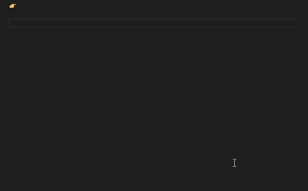

# 【配置文档模板】

# 前置

封装组件的时候，啊，就要写相应的 demo 嘛，每次新建都差不多，可以用 vue 的模板先快捷生成，但又总差了点什么，然后就开始想搞个模板，soso，就发现了这个小技巧哦~~

## 步骤

- 文件 > 首选项 > 用户片段



- 选择相应类型的模板



- 命名模板文件名称



- 然后就写你要的模板咯~下面给个栗子

## 栗子

1. 新建一个 vue 的模板，vscode 会自动生成一个名叫 `xx.code-snippets` 酱紫的文件给你：

```json
{
  // Place your 全局 snippets here. Each snippet is defined under a snippet name and has a scope, prefix, body and
  // description. Add comma separated ids of the languages where the snippet is applicable in the scope field. If scope
  // is left empty or omitted, the snippet gets applied to all languages. The prefix is what is
  // used to trigger the snippet and the body will be expanded and inserted. Possible variables are:
  // $1, $2 for tab stops, $0 for the final cursor position, and ${1:label}, ${2:another} for placeholders.
  // Placeholders with the same ids are connected.
  // Example:
  // "Print to console": {
  // 	"scope": "javascript,typescript",
  // 	"prefix": "log",
  // 	"body": [
  // 		"console.log('$1');",
  // 		"$2"
  // 	],
  // 	"description": "Log output to console"
  // }
}
```

解析一下一些参数叭：

```
- "Print to console"：表示代码片段名称；
- "prefix"：表示呼出代码片段时的快捷方式；
- "body"：代码块内容；换行使用\r\n；
- "description"：说明内容，输入快捷方式时VSCode显示的内容；
- "$1,$2,$0"：指定代码模块生成后，编辑光标出现位置; 使用Tab键进行切换(编辑光标按$1,$2,$3...$0的顺序跳转)，$0是光标最后可切换位置；
```

2. 配置想要的一个初始化 vue 模板，emmm...我的需求其实很简单，就生成这个东东即可：



其实也就是先写个想要的模板，然后匹配响应的规则写在模板配置文件上就好了啦，差不多就酱紫：

```json
{
  "vc-admin content demo": {
    // 代码块适用的语言
    "scope": "vue",
    // 这个就是唤起模板的神秘暗号
    "prefix": "vc-ct",
    // 神秘暗号触发的模板
    "body": [
      "<template>",
      "  <div>",
      "     <VcX />",
      "  </div>",
      "</template>",
      "",
      "<script>",
      "import VcX from '@/content/'",
      "",
      "export default {",
      "  components: {",
      "     VcX",
      "  }",
      "}",
      "</script>",
      "",
      "<style lang=\"scss\" scoped>",
      "</style>"
    ],
    // 代码块描述
    "description": "vc-admin 基础组件 content 的 demo 界面初始化"
  }
}
```

3. 保存，红红火火恍恍惚惚，用它！



## 另一个栗子

- 主要是在写每日记录的时候，需要保持记录的 `markdown` 模板一致，由此而来，每天就多了一个重复的 `copy & paste` 动作，so 感觉用上模板+\_+
- 啊哈，这里的话，主要注意：
  1. `markdown` 生成的模板配置文件是 `.json` 哦；
  2. 还需要在 `settings.json` 中添加一个配置，Ding：

```json
"[markdown]":  {
  "editor.quickSuggestions": true
}
```

Yak！dlq（daliyQ）冲吖~



## 神秘模板暗号集合

```js
// vc-admin 相关的example vue模板
01 vc-b   [business类组件]
02 vc-ct  [content类组件]
03 vc-ly  [layout类组件]

// markdown 笔记相关格式模板
01 dlq    [每日积累模板]
02 wxr    [微信读书阅读记录模板]
```
