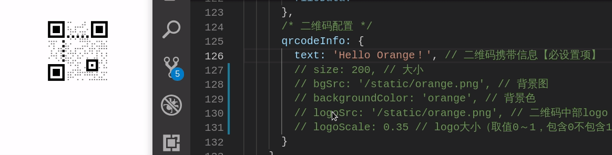

# Component | 自写组件

[GitLab仓 - 组件](https://gitlab.com/SamyeChan/common-components)

---

1. [Pagination 分页](#Pagination)
2. [Table 表格](#Table) - 待解决： 操作栏各按钮的方法匹配
3. [Export 导出](#Export)
4. [Upload 上传](#Upload)
5. [QRcode 二维码](#QRcode)

##  <a name="Pagination">Pagination 分页组件</a>

- 分页组件的功能和 element-ui 无异；
- 仅在每次当前页切换、每页条数修改操作时响应一次新条件下的数据请求；
- 且可自定义分页组件所需功能（是否显示总计、是否可修改每页条数、是否可跳转）；


### 使用

```vue
<template>
  ...
  <!-- 分页组件 -->
  <full-pagination :data="paginationInfo" @refresh="getDataList" />
  ...
</template>

<script>
import FullPagination from '@/components/moudelVue/pagination/FullPagination'

export default {
  components: { FullPagination },
  data () {
    return {
      /* 分页配置 */
      paginationInfo: {
        hasType: ['total', 'sizes', 'jumper'], // 可选项：数据共计条数、页面条数选择、跳转（hasType不配置则默认全含）
        total: 0, // 数据共计条数（需后台传值）【必设置项】
        page: { // 分页请求参数【必设置项】
          pageSize: 100, // 页面大小
          currentPage: 1 // 当前页
        }
      }
    }
  },
  methods: {
    getDataList () { // 获取表格数据（pageSize、currentPage的每次变化触发）
    	// 数据请求
     	Axios(this.paginationInfo.page).then(res => {
        ...
     		this.paginationInfo.total = xxx
     		...
      }).catch(err => {
        ...
      })
    }
  },
  created () {
    this.getDataList()
  }
}
</script>
```

## <a name="Table">Table 表格组件</a>


- 自定义表格列数；
- 可配置自定义数量的每行数据的操作按钮；
- 可进行批量操作；

---

1. 基础版（仅展示数据）；


2. 提供操作按钮版（单行数据操作、批量操作）；


### 使用
```vue
<template>
	...
  <!-- 表格部分 -->
  <basic-table :data="tableInfo" @refresh="getOptions" />
  ...
</template>

<script>
// 组件
import BasicTable from '@/components/BasicTable'

export default {
  components: {	BasicTable },
  data () {
    return {
      /* 表格配置 */
      tableInfo: {
        height: 400, // 表格高度
        emptyText: '昂...暂无数据', // 无数据提示信息
        // ++ 表头配置
        propName: [{
          prop: 'id', // 后台定义参数名【必设置项】
          label: 'ID', // 前端显示表头名称【必设置项】
          width: '80' // 列宽度
        }, {
          prop: 'amount',
          label: '销售额(元)',
          width: '200'
        }, {
          prop: 'count',
          label: '销售量(台)',
          width: '200'
        }, {
          prop: 'rank',
          label: '排名',
          width: '80'
        }],
        // ++ 操作列（默认关闭，即【若不配置则不会渲染】）
        options: {
          isOpt: true, // 是否含操作项（默认关闭）
          isMulti: true, // 是否可批量操作（默认关闭）
          multiPosition: 'right', // 批量操作多选框组位置（默认左侧）
          isEdit: true, // 是否可当页编辑
          // -- 操作项类型
          btnList: [{
            value: 'edit', // 值
            label: '编辑', // 按钮标签值
            type: 'primary', // 按钮类型（element-ui 定义：primary、success、info、warning、danger）
            multiBtn: true // 是否可进行批量操作
          }, {
            value: 'delet',
            label: '删除',
            type: 'danger',
            multiBtn: true
          }, {
            value: 'other01',
            label: '其他01',
            type: 'warning'
          }, {
            value: 'other02',
            label: '其他02',
            type: 'info'
          }, {
            value: 'other03',
            label: '其他03',
            type: 'success'
          }]
        },
        // ++ 表格数据数组【必设置项】
        dataList: []
      }
    }
  },
  methods: {
    getDataList () { // 获取表格数据
      ...
      this.tableInfo.dataList = xxx
      ...
    },
    getOptions (type, data) { // 获得操作项
      switch (type) {
        case 'delet': this.delet(data)
          break
        case 'edit': this.edit(data)
          break
        ...
        default: alert(type)
      }
    },
    delet (val) { // 删除操作（自行定义）
      console.log('删除：', val)
    },
    edit (val) { // 编辑操作（自行定义）
      console.log('编辑：', val)
    }
    ...
  },
  created () {
    this.getDataList()
  }
}
</script>
```

## <a name="Export">Export 导出</a>

导出组件简单分为两类：
1. export - 获取后台传入的二进制流转换后进行文件导出，文件名取自后台（默认项）；
2. download - 直接下载存于前端的文件，文件名可自定义；


### 使用

```vue
<template>
    <!-- 导出 -->
    <basic-export :data="exportInfo" @refresh="handleExport" />
</template>

<script>
import BasicExport from '@/components/moudelVue/exportAndUpload/BasicExport'

export default {
  components: { BasicExport },
  data () {
    return {
      /* 导出配置 */
      exportInfo: {
      	fileOrBlob: '/static/README.md', // 二进制流或文件路径【必设置项】
        btnName: 'Upload - 自定义名', // 按钮文字（不设置则默认显示“导出”）
        type: 'download', // 确定导出类型（后台导出export、前端模板下载download，默认export）
        fileName: '自定义名', // download时可以进行自定义文件名（export时无用）
        res: {} // 响应信息（获取后台文件名时需要，download时无用）
      }
    }
  },
  methods: {
  	// 后台请求，获取待导出二进制流（download时不需要）
  	handleExport () {
      Axios().then(res => {
      	this.exportInfo.fileOrBlob = xxxxxxxxxxxx
      	this.exportInfo.res = res
      }).catch(err => {
         ...
      })
    }
  }
}
</script>
```

## <a name="Upload">Upload 上传（文件、图片等）</a>


- 上传类型分为两类：上传文件(默认) & 上传图片；
- 上传数量分为单个(默认) & 多个；
- 单个文件可重命名、可设置文件大小 & 数量等；

### 使用

```vue
<template>
	...
  <basic-upload :data="uploadInfo" @refresh="getFileList" />
  ...
</template>

<script>
import BasicUpload from '@/components/moudelVue/exportAndUpload/BasicUpload'

export default {
  components: { BasicUpload },
  data () {
    return {
      /* 上传配置 */
      uploadInfo: {
        type: 'img', // 上传类型：文件file、图片img（默认file）
        limit: 1, // 上传个数（默认1）
        maxSize: 1, // 每个文件的限制大小(MB)(默认设置了50MB)
        rename: '重命名', // 单个文件重命名
        fileData: '' // 待上传的文件数据（单文件时：一个File对象，多文件时：一个File对象数组）【必设置项】
      }
    }
  },
  methods: {
    getFileList (val) { // 获取到待上传的File对象
      // （单文件时：一个File对象，多文件时：一个File对象数组）
      this.uploadInfo.fileData = val
    },
    sendToServer () { // 将需上传文件通过 formData 存入数据库
    	let data = new FormData()
    	data.append('参数名', this.uploadInfo.fileData)
    	data.append('其他', xxx)
      ...
      // 后台请求
      Axios(data).then().catch()
    }
  }
}
</script>
```
- 需手动触发才进行上传至服务器操作；

**（ps：出现不符合配置操作后清空所有待上传文件）**

## <a name="QRcode">QRcode 二维码</a>


- 基于插件 vue-qr，封装一个自定义基础二维码组件；
- 配置大小、logo、背景等；
- 可添加二维码名称，且其会根据二维码大小作相应字体大小调整；
- 若文字长度超过图片宽度，显示“...”，且鼠标划过会显示完整信息，而若未超过则不会显示；




### 使用

1. 先安装插件vue-qr：

```bash
npm install vue-qr --save
```

2. 使用组件：

```vue
<template>
  ...
  <basic-q-rcode :data="qrcodeInfo" />
  ...
</template>

<script>
import BasicQRcode from '@/components/moudelVue/QRcode/BasicQRcode'

export default {
  components: { BasicQRcode },
  data () {
    return {
      /* 二维码配置 */ 
      qrcodeInfo: {
        value: 'Hello Orange！', // 二维码携带信息【必设置项】
        size: 300, // 大小（默认200px）
        name: '一二三四五六七八九十', // 二维码名字
        nameColor: '#FFF', // 文字颜色
        bgSrc: '/static/orange.png', // 背景图
        backgroundColor: 'orange', // 背景色（默认白色）
        logoSrc: '/static/orange.png', // 二维码中部logo
        logoScale: 0.35 // logo大小（取值0～1，包含0不包含1，默认0.2）
        // 注：logo大小不能设置遮挡右下方块
      }
    }
   },
  created () {
    this.qrcodeInfo.text = '就假假地在这里装一次设置了二维码信息'
  }
}
</script>
```
**（ps：logo大小不能设置遮挡右下方块）**