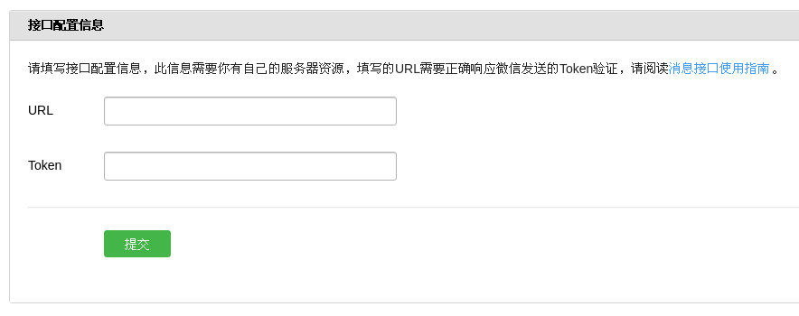
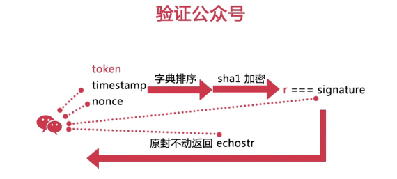

# Learn | node微信开发

- 交互流程
- Nodejs 使用技巧
- 架构项目的方式
- Koa 框架的使用
- ES2015 的新特性

### 辅助 | 网络代理工具

- 推荐：QQ浏览器；
- ngrock 也行；

---

- 公众号开发需要与公众号后台有交互，需要在后台网页进行配置，比如通信的域名地址、JSSDK 的授权地址等等；
- 混用一些 ES6 的特性，比如 yield；
- Web 层使用的框架是 KOA，主要用于处理服务器之间的应用初始化、接口调用以及数据的响应；
- 一个 Promise 库：BlueBird，用于处理和封装异步请求；
- 网络封装使用 request，是对原生 http request 的封装；
- 微信的数据包装方式为 XML，故借助模版库 ejs，将数据作为变量替换到 XML 字符中；
- 工具模块，如 lodash：一些常用方法集，做数组拆分、类型判断等；
- Heredoc，将函数体里的多行注释作为字符串提取出来，主要用于降低拼接字符串的成本；
- raw-body，用来获取一个 http 请求返回的可读流的内容实体；
- 加密部分使用 sha1 这个哈希算法库；
- 微信服务器返回的数据是 xml 格式，所以就没法直接在 js 函数中使用，所以借助 xml2js 这个模块将 xml 数据解析为 js 对象，以方便使用；

### 更需要关注的点

微信公众号的配置接入流程、加密认证环节、票据 access_token 的获取

### 基础

- 可利用 Nodejs 开发一些网页或爬虫工具，来对 Nodejs API 和它的技术特点有基本认知；
- 具后端语言经验，主要弄明白一个网络 http 请求从开始到结束中间所经过的环节；

## Day 01

1. 了解微信号的种类特点；
2. 本地代理环境的搭建以及最入门的加密认证；

```
// 结合看
域名服务器环境配置
利用 QQ 浏览器代理调试端口

// 容易错
加密认证逻辑
```

### 微信号分类和功能

#### 微信号分类

- 企业号：不适合个人，是企业/组织提供移动应用的入口，帮助企业建立与员工、上下游供应链及企业应用间的连接；
- 订阅号：适合个人、小团队，主要用于信息传播，帮助管理用户以及和用户互动；
- 服务号：为企业/组织提供更强大的业务服务与用户管理能力，如支付、智能接口；

认证后的公众号具有更多的功能 → 一般需要一个开过户的企业；

- 订阅号（认证）：可直接在添加好友里搜索关键词找到；

##### 订阅号 vs 服务号

1. 出现位置不同；
2. 单月可推送数量不同：订阅号一日一推、服务号一月4推；
3. 订阅号没有9大接口和支付功能；

```
- 语音识别
- 客服消息 - 公众号可在用户发送消息后的24小时内回复用户；
- OAuth 2.0网页授权 - 用户请求授权，可获取用户更多信息；
- 生成带参二维码；
- 获取用户地理位置，可做微信导航；
- 获取用户基本信息 - 根据加密后的用户 OpenID，以及一系列参数交互实现；
- 获取关注者列表；
- 用户分组接口；
- 上传/下载多媒体文件；
```

### 域名

- www.tunnel.mobl；
- nodejs 的 localtunnel 服务；
- PageKite；
- 花生壳；

### 配置公众号

- 测试公众号；
- 配置微信公众号后台；

#### 接入公众号

1. 配置微信公众号后台；
2. 验证公众号；



- URL - 开发者用于接受微信消息和事件的接口url（微信会将消息、事件push到这个url里面）；
- Token - 开发者自身填写，用于生成签名（这个token是会和接口url中的她token进行一个比对，保证一个安全性）



1. 将 token、timestamp、nonce 三个参数进行字典序排序；
2. 将三个参数字符串拼接成一个字符串进行 sha1 加密；
3. 将加密后的字符串与 signature 对比，若相同，就证明请求来源于微信，我们直接原样返回 echostr 参数内容，接入验证就成功咯；

### koa框架

- 代码可以更精简、更易懂，对于反反复复的异步交互更适合这个框架实现；
- 接入
```js
'use strict'

// 导入koa，和koa 1.x不同，在koa2中，我们导入的是一个class，因此用大写的Koa表示:
const Koa = require('koa');
const sha1 = require('sha1');
const config = {
  wechat: {
    appID: 'xxx',
    appSecret: 'xxx',
    token: 'xxx'
  }
};

// 创建一个Koa对象表示web app本身:
const app = new Koa();

// 对于任何请求，app将调用该异步函数处理请求：
app.use(async (ctx, next) => {
  await next();
  ctx.response.type = 'text/html';
  let token = config.wechat.token;
  let signature = ctx.url.split('signature=')[1].split('&')[0];
  let echostr = ctx.url.split('echostr=')[1].split('&')[0];
  let timestamp = ctx.url.split('timestamp=')[1].split('&')[0];
  let nonce = ctx.url.split('nonce=')[1];
  let str = [token, timestamp, nonce].sort().join('');
  let sha = sha1(str);
  if (sha === signature) {
    ctx.response.body = echostr + '';
  } else {
    ctx.response.body = 'wrong';
  }
});


// 在端口8080监听:
app.listen(8080);
console.log('app started at port 8080...');
```
## Day 02

1. 了解微信中消息与回复的种类；
2. 完成一个简单的回复机器人小例子；
3. 使用 QQ 浏览器代理调试端口；

#### localtunnel

2个缺点：
1. 不支持自定义域名映射；
2. 映射以后，一旦本机服务终止，再重启就失去了这个映射连接；

### 无域名情况下的微信开发解决方案

1. utralhook服务；
2. QQ浏览器，其中有配套的解决方案；

### 微信中可接收消息的 7 种类型

- 文本
- 图片
- 语音
- 视频
- 小视频
- 地理位置
- 链接

### 微信中可回复消息的 6 种类型

- 文本
- 图片
- 语音
- 视频
- 音乐
- 图文

post & xml

### 注意事项

1. 微信公众号接口只支持 80 端口；
2. 微信后台配置的 URL 是唯一能接收到消息、事件的入口，故我们在公众号中的所有操作，都基于这个 url 进行交互；
3. 调用所有微信接口时几乎全部使用 https 协议；
4. 用户向公众号发送消息时，会传过来 OpenID（用户微信号加密后的值），每个用户在每个公众号中 OpenID 唯一；
5. 在开发阶段，需要留意把报错信息，如全局返回码（非常重要！！！）；
6. 在和微信服务器交互时，需要满足各个接口的规范限制、调用频率限制，也需要特别注意模版消息、用户数据等敏感信息的使用规范；

### access_token

- 每2个小时（7200s）自动失效，需要重新获取；
- 只要更新了，之前的就不能再用了；

→ 系统每隔2小时自动刷新；
→ 为方便频繁调用，需要将票据存储在一个唯一的地方；